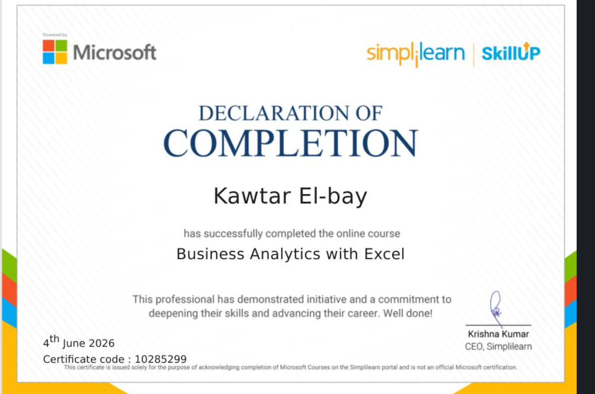
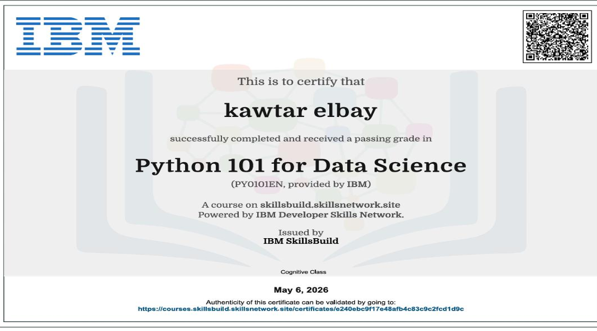
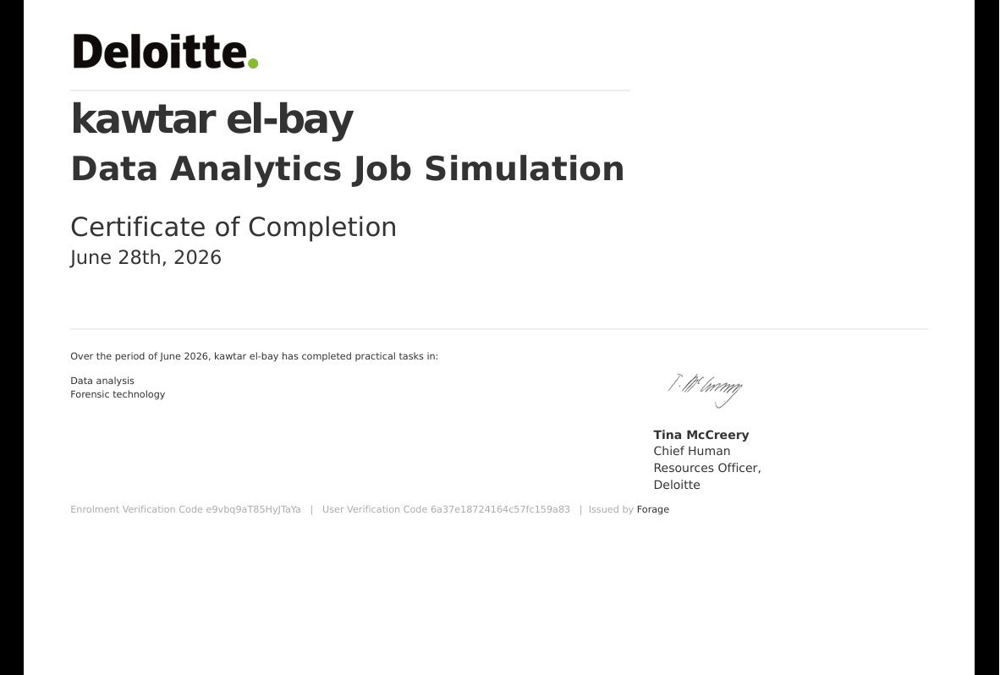
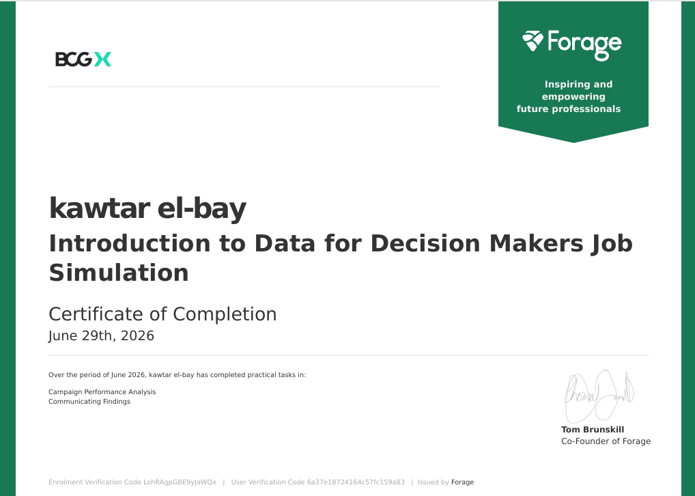
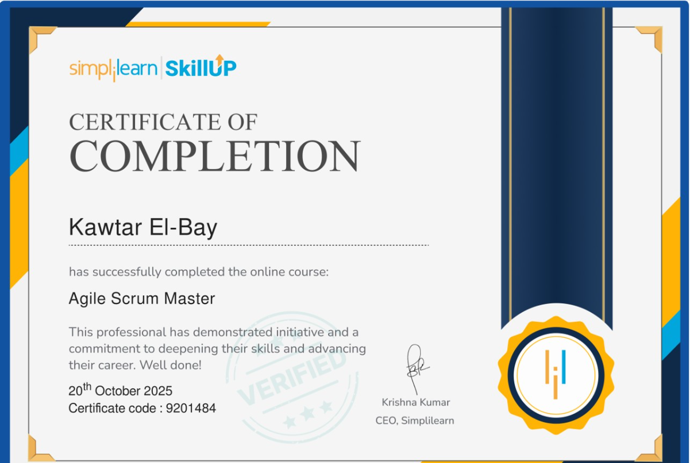
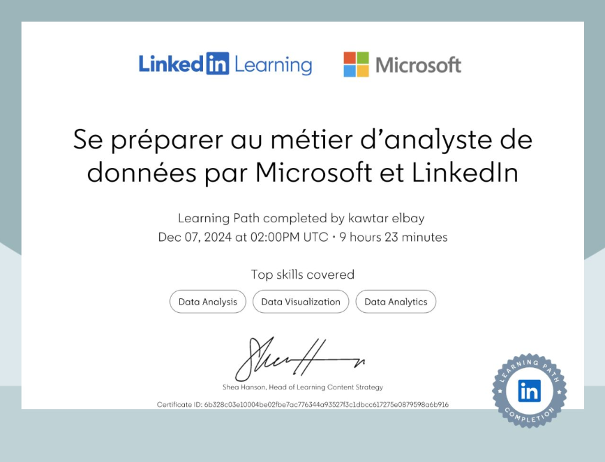

# Certificates – Kawtar Elbay

This folder contains all my professional certifications and achievements.

---

## 1. Business Analytics with Excel – Simplilearn (2026)

**Issuing Organization:** Simplilearn  
**Date:** 2026  
**Skills:** Data Analysis with PivotTables, Statistics with Excel

---

## 2. Python for Data Science – IBM SkillsBuild (2026)

**Issuing Organization:** IBM SkillsBuild  
**Date:** 2026  
**Skills:** Python Programming, Data Analysis, Pandas, NumPy

---

## 3. Data Analytics Program – Deloitte (Forage) (2026)

**Issuing Organization:** Forage (Deloitte)  
**Date:** 2026  
**Skills:** Data Analytics, Tableau, Data Visualization, Dashboard Design

---

## 4. Data for Decision Making – BCG X (Forage) (2026)

**Issuing Organization:** Forage (BCG X)  
**Date:** 2026  
**Skills:** Data Analysis, Decision Making, Campaign Performance Analysis

---

## 5. Agile Scrum Master Basics – Simplilearn (2025)

**Issuing Organization:** Simplilearn  
**Date:** 2025  
**Skills:** Agile Methodology, Scrum Project Management, Team Collaboration

---

## 6. Data Analytics – LinkedIn & Microsoft (2024)

**Issuing Organization:** LinkedIn & Microsoft  
**Date:** 2024  
**Skills:** Data Analysis, Data Visualization, Business Intelligence

---

