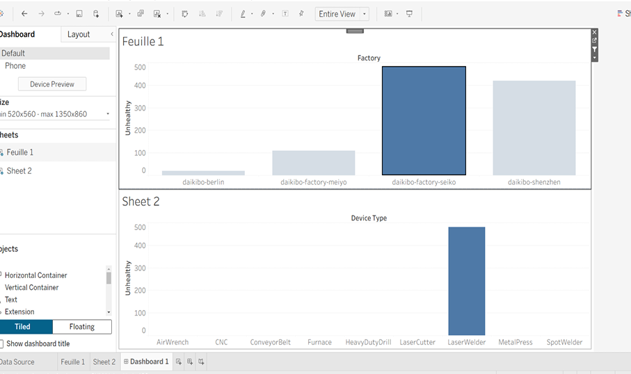
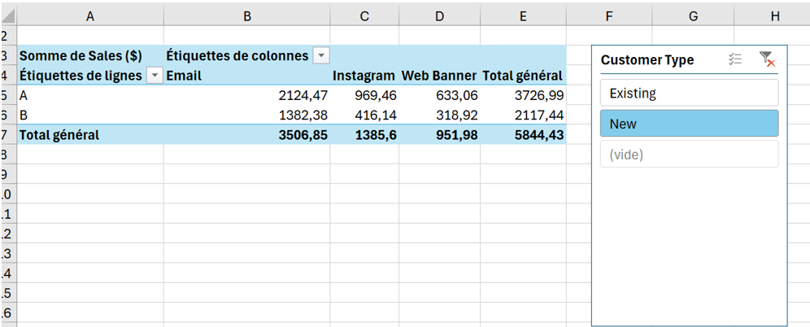

# Projects – Kawtar Elbay

---

## 1. Data Analytics – Deloitte (Forage)

**Date:** June 2026  
**Type:** Virtual Work Experience Program

### Project Overview
This project is part of the virtual work experience program with Deloitte on Forage. The goal was to analyze telemetry data collected from 4 factories (Daikibo) to identify machine breakdown patterns.

### Context
The client, Daikibo, has 4 factories:
- Daikibo Factory Meiyo (Tokyo, Japan)
- Daikibo Factory Seiko (Osaka, Japan)
- Daikibo Berlin (Berlin, Germany)
- Daikibo Shenzhen (Shenzhen, China)

Each location has 9 types of machines, sending a message every 10 minutes. Data was collected for one month (May 2021).

### Objectives
1. Identify the location where machines broke the most
2. Determine which machines broke most often in that location

### Tasks Performed
- Analyzed telemetry data using Tableau
- Created a calculated measure field "Unhealthy" with a value of 10 for each unhealthy status
- Created a bar chart "Down Time per Factory"
- Created a bar chart "Down Time per Device Type"
- Designed an interactive dashboard with both charts, using the first chart as a filter

### Results
- Identified the factory with the most machine breakdowns
- Determined the most frequently broken machines in that location
- Delivered an interactive dashboard for data exploration

### Technologies Used
- **Tableau** – Data visualization and dashboard creation
- **Data Analysis** – Telemetry data analysis
- **Dashboard Design** – Interactive dashboards

### Screenshot

---

## 2. Data for Decision Making – BCG X (Forage)

**Date:** June 2026  
**Type:** Virtual Work Experience Program

### Project Overview
This project is part of the virtual work experience program with BCG X on Forage. The goal was to review digital ad campaign performance data and identify insights to guide smarter business decisions.

### Objectives
- Analyze campaign performance data
- Identify key insights and trends
- Provide data-driven recommendations for future campaigns

### Tasks Performed
- Reviewed digital ad campaign performance data
- Analyzed campaign metrics to identify patterns
- Developed recommendations based on data insights
- Prepared a presentation of findings

### Results
- Identified key performance indicators and trends
- Provided actionable recommendations for campaign optimization
- Demonstrated how data drives strategic decision-making

### Technologies Used
- **Data Analysis** – Campaign performance analysis
- **Decision Making** – Strategic recommendations
- **Business Intelligence** – Data-driven insights

### Screenshot

---

## 3. Power BI – San Francisco Police Incidents

**Date:** April 2026  
**Type:** Academic Project

### Project Overview
This project involved analyzing public safety data from the San Francisco Police Department to create an interactive decision-making dashboard.

### Objectives
- Perform advanced data cleaning
- Create an interactive dashboard for incident analysis
- Identify high-risk areas and propose strategies to reduce incidents

### Tasks Performed
- Performed advanced data cleaning with Power Query
- Created an interactive dashboard with key performance indicators
- Analyzed trends to identify zones at risk
- Proposed strategies to limit incidents based on data insights

### Results
- Delivered an interactive Power BI dashboard
- Identified high-risk areas and incident patterns
- Provided actionable strategies for incident reduction

### Technologies Used
- **Power BI** – Dashboard creation
- **Power Query** – Data cleaning and transformation
- **Data Visualization** – Interactive visualizations
- **Data Analysis** – Trend analysis and pattern identification

### Screenshot

---

## 4. NoSQL – Vehicle Rental System

**Date:** April 2026  
**Type:** Academic Project

### Project Overview
This academic project involved developing a vehicle rental management application using NoSQL database and Streamlit.

### Objectives
- Import large datasets into Firestore
- Develop a complete CRUD interface
- Create a user-friendly application

### Tasks Performed
- Imported 2,000+ contracts from CSV to Firestore
- Developed a full CRUD interface (Create, Read, Update, Delete)
- Built a user interface with Streamlit
- Implemented search and filtering functionalities

### Results
- Fully functional vehicle rental application
- Easy-to-use interface for managing contracts
- Efficient data storage and retrieval

### Technologies Used
- **Python** – Programming language
- **Firestore** – NoSQL database
- **Streamlit** – Web application framework
- **CSV** – Data import

### Screenshot

---

## 5. Python – Chronic Kidney Disease (CKD) Diagnosis

**Date:** March 2026  
**Type:** Academic Project

### Project Overview
This academic project involved analyzing medical data to predict the risk of Chronic Kidney Disease (CKD) using machine learning techniques.

### Objectives
- Perform data cleaning and exploratory analysis
- Build machine learning models for CKD prediction
- Achieve high-accuracy predictions

### Tasks Performed
- Data cleaning and preprocessing with Pandas
- Exploratory data analysis with visualizations
- Applied machine learning techniques:
  - Classification – Predicting CKD risk
  - Clustering – Grouping similar patient profiles
  - Dimensionality Reduction – Reducing features while preserving information
- Evaluated model performance with metrics

### Results
- Successfully predicted CKD risk with high accuracy
- Identified key features contributing to CKD diagnosis
- Delivered a Jupyter Notebook with complete analysis

### Technologies Used
- **Python** – Programming language
- **Pandas** – Data manipulation
- **Scikit-learn** – Machine learning models
- **Matplotlib / Seaborn** – Data visualization
- **Google Colab** – Development environment

### Screenshot

---

## 6. Java – GameVersAcademy Catalog Management

**Date:** February 2026  
**Type:** Academic Project

### Project Overview
This academic project involved developing a catalog management application for GameVersAcademy using Java and Eclipse IDE.

### Objectives
- Implement user data management
- Create a functional CRUD application
- Develop an interactive user interface

### Tasks Performed
- Implemented CRUD operations
- Developed filtered search functionality
- Created an interactive table for data display
- Managed user data efficiently

### Results
- Fully functional catalog management application
- User-friendly interface for data management
- Efficient search and filtering capabilities

### Technologies Used
- **Java** – Programming language
- **Eclipse IDE** – Development environment
- **CRUD Operations** – Data management

### Screenshot

---

*Last updated: July 2026*
