# Projects – Kawtar Elbay

---

## 1. Data Analytics – Deloitte (Forage)

**Date:** June 2026  
**Type:** Virtual Work Experience Program

### Project Overview
This project is part of the virtual work experience program with Deloitte on Forage. The goal was to analyze telemetry data collected from 4 factories (Daikibo) to identify machine breakdown patterns and investigate gender pay equality.

---

### Task 1: Telemetry Data Analysis

#### Context
The client, Daikibo, has 4 factories:
- Daikibo Factory Meiyo (Tokyo, Japan)
- Daikibo Factory Seiko (Osaka, Japan)
- Daikibo Berlin (Berlin, Germany)
- Daikibo Shenzhen (Shenzhen, China)

Each location has 9 types of machines, sending a message every 10 minutes. Data was collected for one month (May 2021) and shared as a single JSON file.

#### Objectives
1. Identify the location where machines broke the most
2. Determine which machines broke most often in that location

#### Tasks Performed
- Analyzed telemetry data using Tableau
- Created a calculated measure field "Unhealthy" with a value of 10 for each unhealthy status (representing 10 minutes of potential downtime)
- Created a bar chart "Down Time per Factory"
- Created a bar chart "Down Time per Device Type"
- Designed an interactive dashboard with both charts, using the first chart as a filter

#### Results
- Identified the factory with the most machine breakdowns
- Determined the most frequently broken machines in that location
- Delivered an interactive dashboard for data exploration

#### Dashboard Screenshot

### Task 2: Gender Pay Equality Analysis

#### Context
After internal complaints about gender inequality in terms of salary, Daikibo Industrials requested an investigation. The Forensic Tech team built an algorithm to quantify the "level of gender pay equality" for most job roles within the company, in all company locations.

#### Data Provided
An Excel file (`Equality Table.xlsx`) containing:
1. **Factory** – Location name
2. **Job Role** – Employee position
3. **Equality Score** – Integer between -100 and +100 (0 is ideal)

#### Objectives
Create a 4th column (`Equality class`) classifying the equality score into 3 types:

| Class | Score Range |
| :--- | :--- |
| **Fair** | Between -10 and +10 |
| **Unfair** | Less than -10 OR greater than +10 |
| **Highly Discriminative** | Less than -20 OR greater than +20 |

#### Tasks Performed
- Analyzed the equality data in Excel
- Created a new column "Equality class" using conditional logic
- Classified each employee based on their equality score

#### Results Table

### Technologies Used
- **Tableau** – Data visualization and dashboard creation
- **Excel** – Data analysis and classification
- **Data Analysis** – Telemetry data and equality analysis
- **Dashboard Design** – Interactive dashboards

---

## 2. Data for Decision Making – BCG X (Forage)

**Date:** June 2026  
**Type:** Virtual Work Experience Program

### Project Overview
This project is part of the virtual work experience program with BCG X on Forage. The goal was to review digital ad campaign performance data and identify insights to guide smarter business decisions.

---

### Task 1: Data Analysis

#### Context
A digital ad campaign was launched across multiple channels (Email, Instagram, Web) using two different campaign types:
- **Campaign A** – Conversational tone
- **Campaign B** – Promotional tone

The objective was to analyze sales performance by channel and campaign to optimize future marketing strategies.

#### Tasks Performed
1. **Total Sales by Channel** – Analyzed sales performance across different channels
2. **Total Sales by Campaign** – Compared the performance of Campaign A vs Campaign B
3. **Pivot Table Analysis** – Created a pivot table combining both channel and campaign data
4. **New Customer Segmentation** – Added a slicer to isolate new customer data

#### Key Insights
- **Campaign A (Conversational tone)** performed better on discovery channels (Instagram, Web) for acquiring new customers
- **Campaign B (Promotional tone)** performed better on Email for retaining and converting existing customers

#### Results Table with New Customer Segment

### Task 2: Communicating Findings

#### Objective
Prepare a clear and concise presentation of the analysis findings to stakeholders.

#### Tasks Performed
- Synthesized data insights into actionable recommendations
- Prepared a presentation summarizing:
  - Campaign performance by channel
  - Customer acquisition vs retention strategies
  - Recommended marketing approach

#### Final Recommendations
- **For new customer acquisition:** Use Campaign A (conversational tone) on discovery channels (Instagram, Web)
- **For existing customer retention:** Use Campaign B (promotional tone) on Email

#### Presentation Screenshot
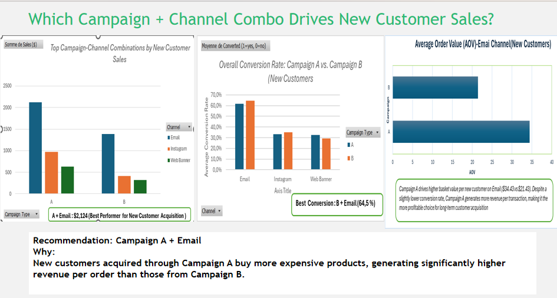

### Technologies Used
- **Data Analysis** – Campaign performance analysis
- **Decision Making** – Strategic recommendations
- **Business Intelligence** – Data-driven insights
- **Excel** – Pivot tables and data segmentation

---

## 3. Power BI – San Francisco Police Incidents

**Date:** April 2026  

### Project Overview
This project involved analyzing and visualizing incidents reported to the San Francisco Police Department. The goal was to identify spatial and temporal trends to support operational decision-making.

### Objectives
- Identify high-risk districts
- Prioritize police resource allocation based on real needs
- Analyze temporal variations (by month, day, hour)

### Graphs

#### Graph 1: Incidents by District
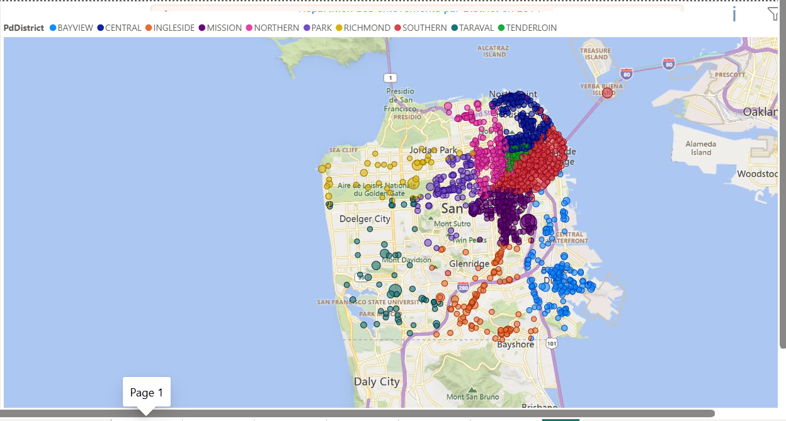

#### Graph 2: Incidents by Category
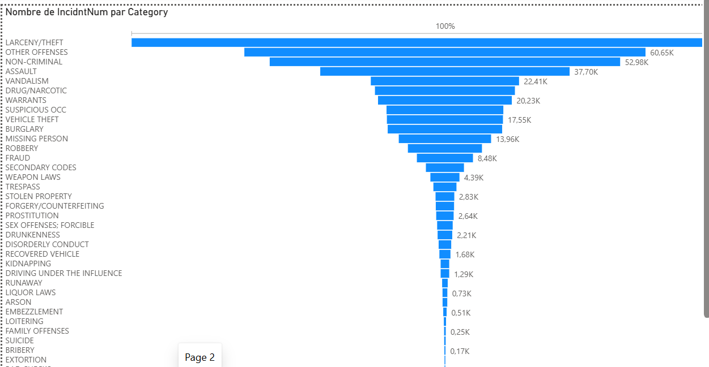
**Result:** **LARCENY/THEFT** is the most frequent incident category with approximately **100,000** reported cases, followed by **OTHER OFFENSES** (60.65K),and **NON-CRIMINAL** (52.98K). To reduce incidents, authorities should focus on theft prevention in high-risk areas, increase surveillance, and strengthen community awareness programs.

#### Graph 3: Incidents by Category and Year (2010-2014)
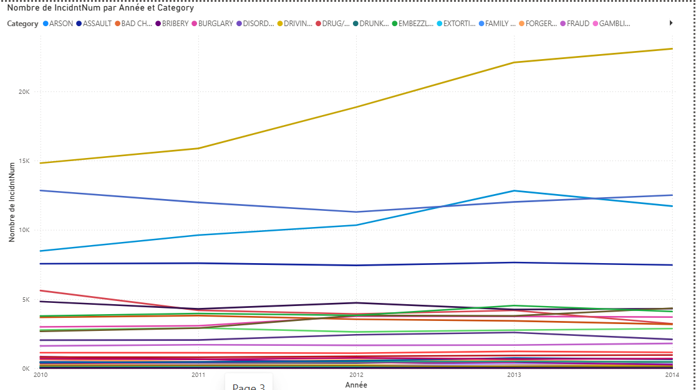

#### Graph 4: Evolution of Kidnapping Incidents by Year (2010-2014)
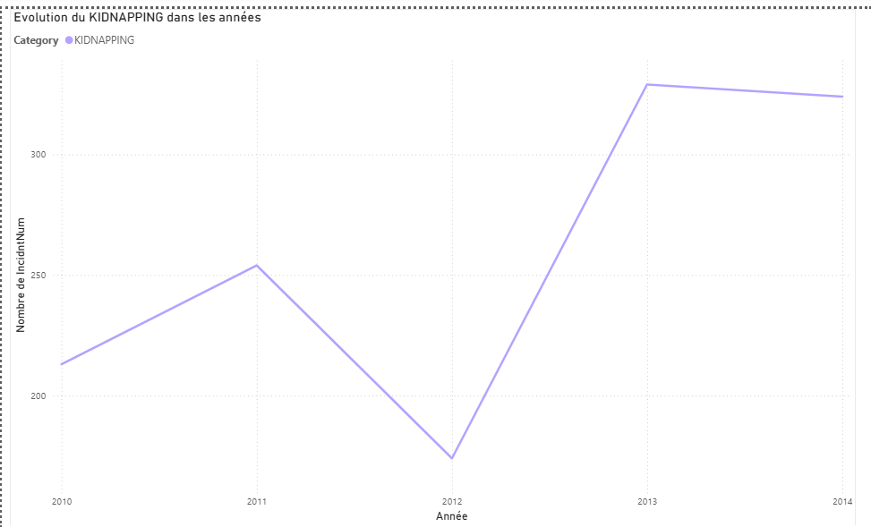

### Key Insights
- **LARCENY/THEFT** is the most frequent crime category, followed by **OTHER OFFENSES** and **NON-CRIMINAL** incidents
- **Kidnapping** incidents peaked in 2013 (330 reports) and hit a low in 2012 (170 reports)
- Data-driven insights can help optimize police resource allocation and reduce incidents in high-risk zones

### Technologies Used
- **Power BI** – Visualization
- **Power Query** – Data cleaning and transformation
- **Data Visualization** – Interactive dashboards
- **Data Analysis** – Trend analysis and pattern identification

---

## 5. NoSQL – Vehicle Rental System

**Date:** April 2026  

### Project Overview
This project involved developing a vehicle rental management application using NoSQL database and Streamlit. The application allows users to manage contracts, vehicles, and customers efficiently.

### Objectives
- Import large datasets into Firestore
- Develop a complete CRUD interface
- Create a user-friendly application

### Tasks Performed
- Imported 2,000+ contracts from CSV to Firestore
- Developed a full CRUD interface (Create, Read, Update, Delete)
- Built a user interface with Streamlit
- Implemented search and filtering functionalities

### Screenshots

#### Screenshot 1: Data Import from CSV to Firestore
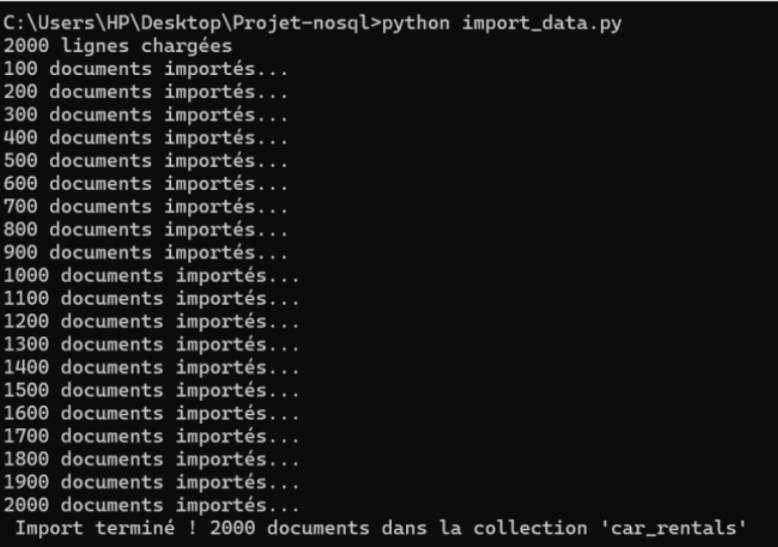

**What it shows:** This screenshot displays the successful import of 2,000+ vehicle rental contracts from CSV to Firestore, with all documents imported into the 'car_rentals' collection.

#### Screenshot 2: Code for Streamlit Interface (Page Config & Firebase Init)
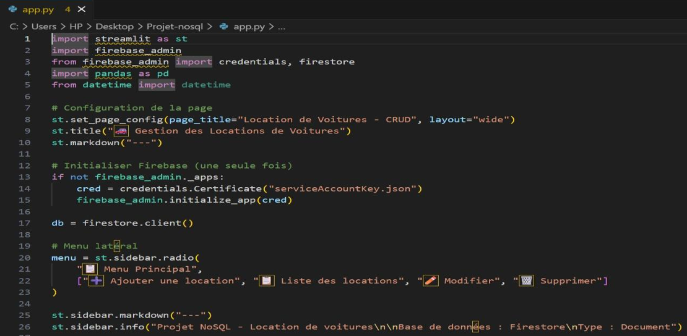

**What it shows:** This screenshot shows the Python code for Streamlit page configuration, Firebase/Firestore initialization, and the main menu structure for the CRUD application.

#### Screenshot 3: Project Files Used
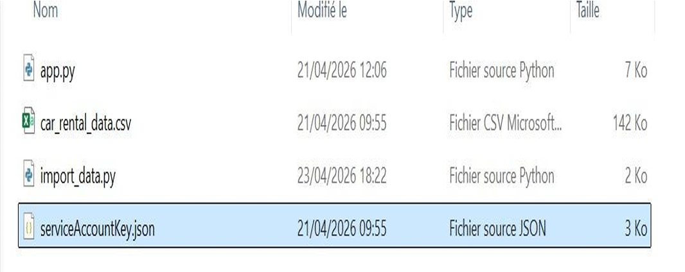

**What it shows:** This screenshot lists all project files used in the application, including app.py (Streamlit interface), car_rental_data.csv (2,000+ contracts), import_data.py (data import script), and serviceAccountKey.json (Firebase credentials).

#### Screenshot 4: Streamlit Application Launch
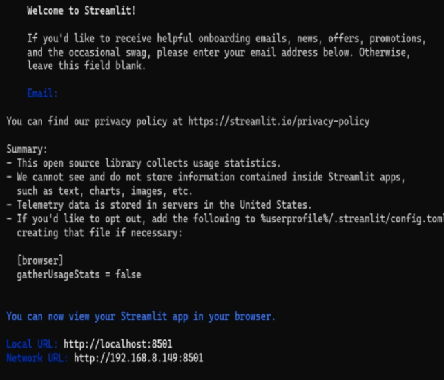

**What it shows:** This screenshot shows the terminal output when launching the Streamlit application, indicating that the app is running locally at `http://localhost:8501`.

#### Screenshot 5: Full CRUD Application Interface
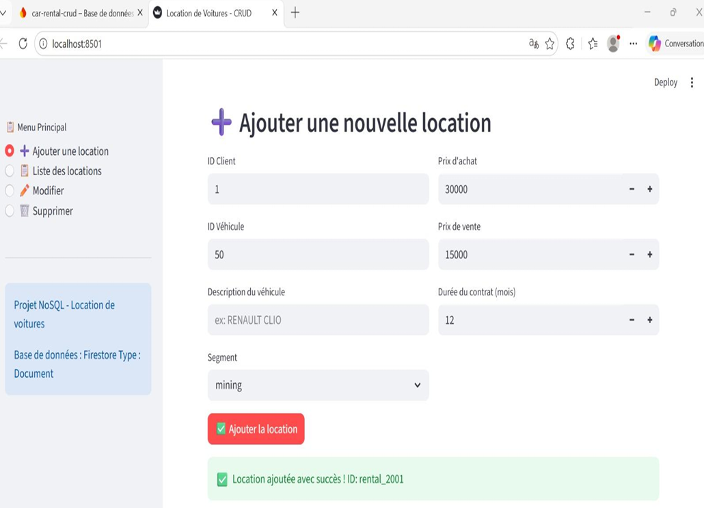

**What it shows:** This screenshot presents the complete Streamlit application interface displaying the CRUD operations with fields for Client ID, Vehicle ID, Description, Duration, and Segment, along with a success message for adding a rental.

### Results
- Fully functional vehicle rental application
- Easy-to-use interface for managing contracts
- Efficient data storage and retrieval

### Technologies Used
- **Python** – Programming language
- **Firestore** – NoSQL database
- **Streamlit** – Web application framework
- **CSV** – Data import

---

## 5. Python – Chronic Kidney Disease (CKD) Diagnosis

**Date:** March 2026  

### Project Overview
This project involved analyzing medical data to predict the risk of Chronic Kidney Disease (CKD) using machine learning techniques.

### Objectives
- Perform data cleaning and exploratory analysis
- Build machine learning models for CKD prediction
- Achieve high-accuracy predictions

### Tasks Performed
- Data cleaning and preprocessing with Pandas
- Exploratory data analysis with visualizations
- Applied machine learning techniques:
  - Classification – Predicting CKD risk
  - Clustering – Grouping similar patient profiles
  - Dimensionality Reduction – Reducing features while preserving information
- Evaluated model performance with metrics

### Results
- Successfully predicted CKD risk with high accuracy
- Identified key features contributing to CKD diagnosis
- Delivered a Jupyter Notebook with complete analysis

### Technologies Used
- **Python** – Programming language
- **Pandas** – Data manipulation
- **Scikit-learn** – Machine learning models
- **Matplotlib / Seaborn** – Data visualization
- **Google Colab** – Development environment

### Screenshot

---

## 6. Java – GameVersAcademy Catalog Management

**Date:** February 2026  

### Project Overview
This project involved developing a catalog management application for GameVersAcademy using Java and Eclipse IDE. The application allows users to manage game mods and clients efficiently through a complete CRUD interface.

### Objectives
- Implement user data management (Client and Mod classes)
- Create a functional CRUD application
- Develop an interactive user interface
- Provide dashboard with key statistics

### Tasks Performed
- Implemented CRUD operations for Mods and Clients
- Developed filtered search functionality by title or category
- Created interactive tables for data display
- Managed user data efficiently
- Built a dashboard with statistics (total mods, downloads, categories)

### Screenshots

#### Screenshot 1: Java Code Implementation (CRUD Operations)
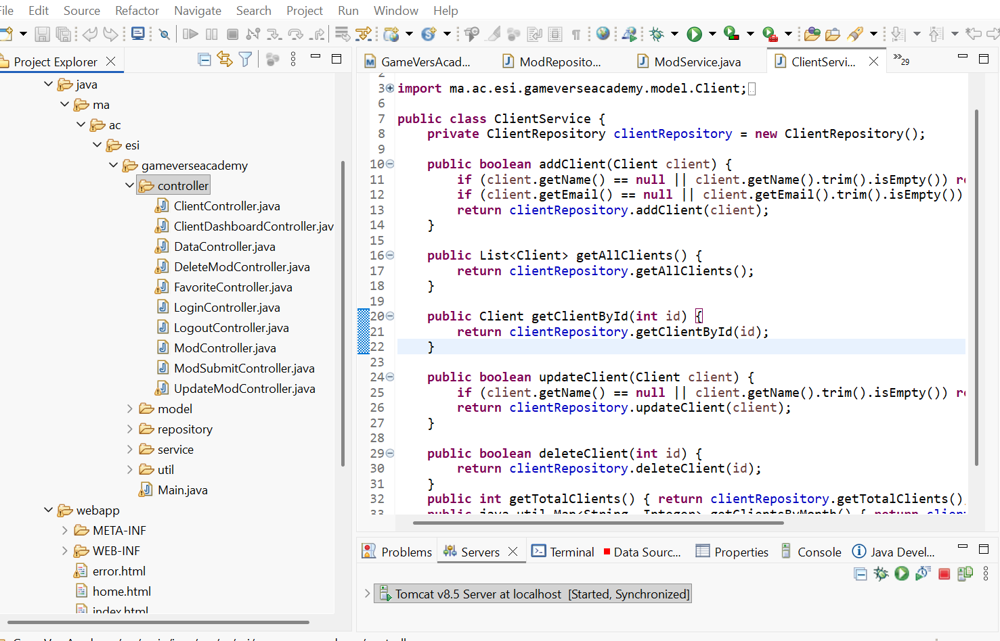

**What it shows:** This screenshot displays the Java code for the CRUD operations, including methods for adding, updating, deleting, and retrieving clients from the database (ClientService class).

---

#### Screenshot 2: Application Interface - Mods Catalogue
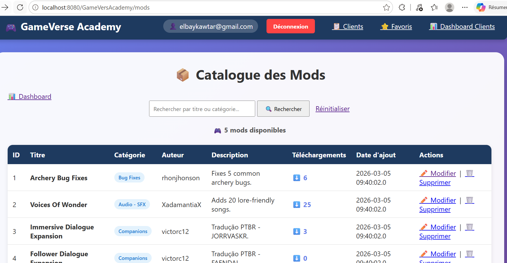

**What it shows:** This screenshot shows the main catalogue interface of the GameVersAcademy application, displaying the list of game mods with search functionality by title or category. It shows 5 mods available with details (ID, Title, Category, Author, Description, Downloads, Date added) and actions (Modify, Delete).

---

#### Screenshot 3: Application Interface - Client Management
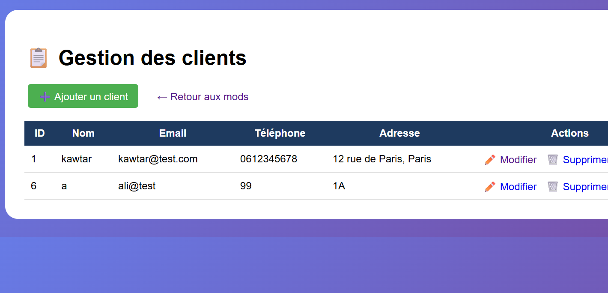

**What it shows:** This screenshot displays the client management interface with a table showing client details (ID, Name, Email, Phone, Address) and actions (Modify, Delete). It also includes buttons to add a new client and return to the mods catalogue. This demonstrates the CRUD functionality for both Mod and Client classes.

---

#### Screenshot 4: Dashboard with Statistics
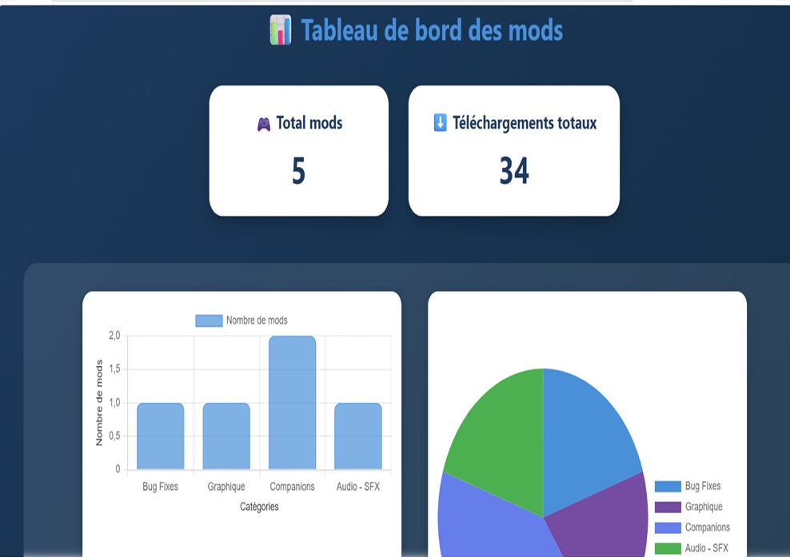

**What it shows:** This screenshot presents the dashboard with key statistics for the GameVersAcademy platform, including total mods available, category distribution, and user engagement metrics.

---

### Results
- Fully functional catalog management application
- User-friendly interface for managing mods and clients
- Efficient search and filtering capabilities
- Real-time statistics dashboard

### Technologies Used
- **Java** – Programming language
- **Eclipse IDE** – Development environment
- **CRUD Operations** – Data management for Mods and Clients
- **Tomcat** – Server deployment
- **JSP/Servlets** – Web application architecture
- **Mod Class** – Game mod management
- **Client Class** – User management
