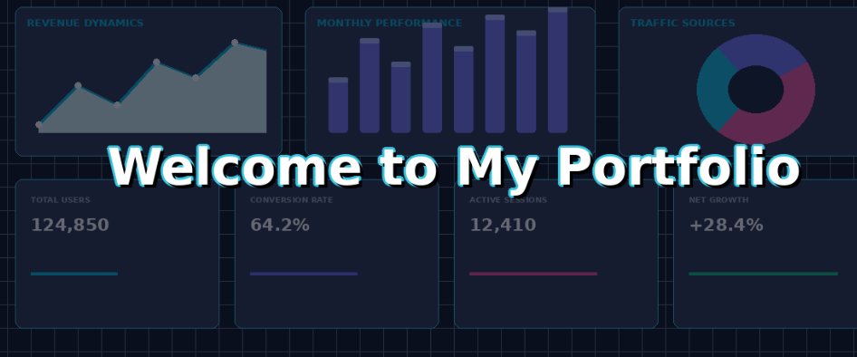

# kawtar-elbay-projects:
# Kawtar Elbay – Data Science Portfolio

## About Me

  

---

## 👩‍💻 About Me

I am a **Data Science Engineering student** at **ESI Rabat**, specializing in **Knowledge Engineering and Data Science (ICSD)**. I am passionate about data analysis, Machine Learning, and Business Intelligence.

I use **Python, Power BI, SQL, and Tableau** to transform **raw data into actionable insights**, solve real-world problems, and help businesses **make the right decisions**.

---

## 🛠️ Skills & Tools

| Tool | Usage |
| :--- | :--- |
| **Python** | Data cleaning, analysis, Machine Learning |
| **SQL** | Data extraction, transformation, querying |
| **Power BI** | Interactive dashboards, Business Intelligence |
| **Tableau** | Data visualization, storytelling |

---

## 📊 What I Do

- **Transform raw data** into clean, structured datasets
- **Build dashboards** that reveal hidden trends
- **Solve problems** using data-driven approaches
- **Help decision-makers** act with confidence

---

## Projects

| Project | Description | Technologies |
| :--- | :--- | :--- |
| **Deloitte – Data Analytics** | Analysis of telemetry data from 4 factories using Tableau | Tableau, Data Visualization |
| **BCG X – Data for Decision Making** | Analysis of digital ad campaign performance | Data Analysis, Decision Making |
| **Power BI – San Francisco Incidents** | Creation of an interactive dashboard for incident analysis | Power BI, Power Query |
| **Python – CKD Diagnosis** | ML modeling for chronic kidney disease prediction | Python, Pandas, Scikit-learn |
| **NoSQL – Vehicle Rental** | Vehicle rental management application | Python, Firestore, Streamlit |
| **Java – GameVersAcademy** | Catalog management application | Java, Eclipse IDE |

---

## Certificates

| Certificate | Organization | Date |
| :--- | :--- | :--- |
| Databricks Fundamentals | Databricks | 2026 |
| Business Analytics with Excel | Simplilearn | 2026 |
| Python for Data Science | IBM SkillsBuild | 2026|
| Data Analytics Program | Deloitte (Forage) | 2026 |
| Data for Decision Making | BCG X (Forage) | 2026 |
| Agile Scrum Master Basics | Simplilearn | 2025 |
| Data Analytics | LinkedIn & Microsoft | 2024 |

---

## 💼 Professional Experience

| Period | Company | Role | Key Achievements | Tools |
| :--- | :--- | :--- | :--- | :--- |
| **Jul 2026 – Aug 2026** | **HCP** (Haut-Commissariat au Plan) – Rabat | Data Science, NLP & LLM Intern | Built a GenAI/RAG system to extract statistical data from complex documents (70% time saving); implemented RAG with ChromaDB, Ollama, LangChain | Python, RAG, LLM, NLP, ChromaDB, LangChain |
| **Aug 2026 – Sep 2026** | **CodeAlpha** – Remote | Virtual Data Analytics & NLP Intern | EDA and prediction on Amazon Fine Food Reviews; built ML pipeline for sentiment classification | Python, Pandas, Scikit-Learn |
| **Jul 2025 – Aug 2025** | **Bond Fish** – Morocco | Operational Intern | Analyzed production data and created visualizations to improve operational performance | Data Analysis, Visualization |

## Contact

- **LinkedIn :** [linkedin.com/in/kawtar-elbay-85a597281](https://www.linkedin.com/in/kawtar-elbay-85a597281)

**Author:** Kawtar Elbay  

---

